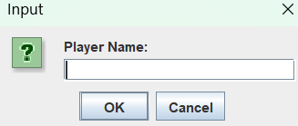
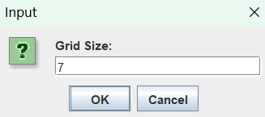
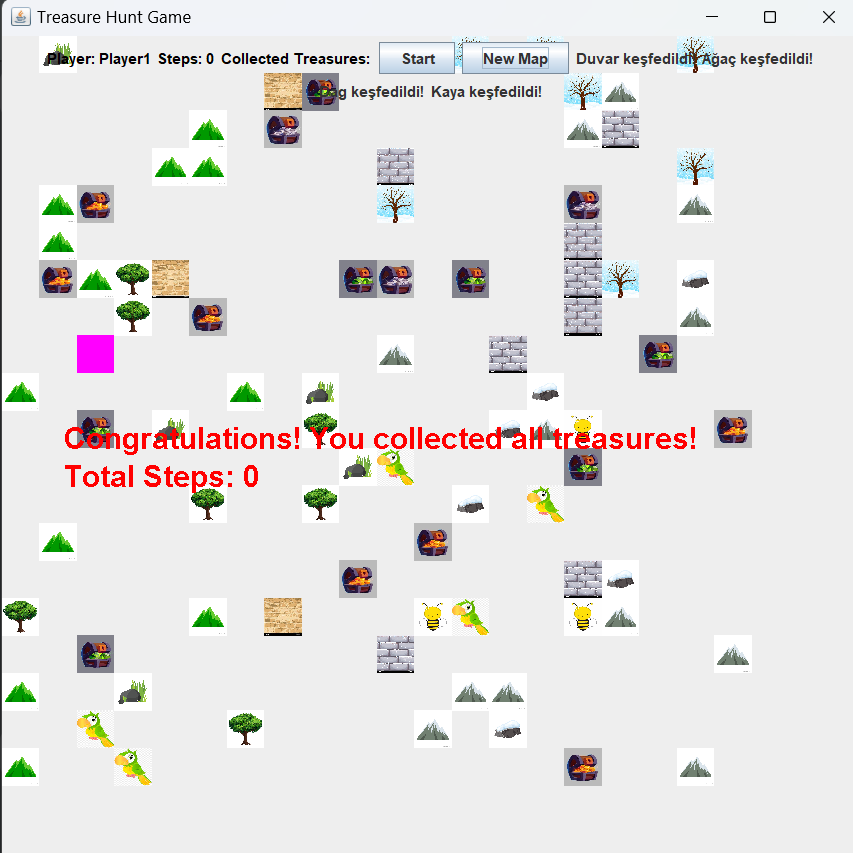
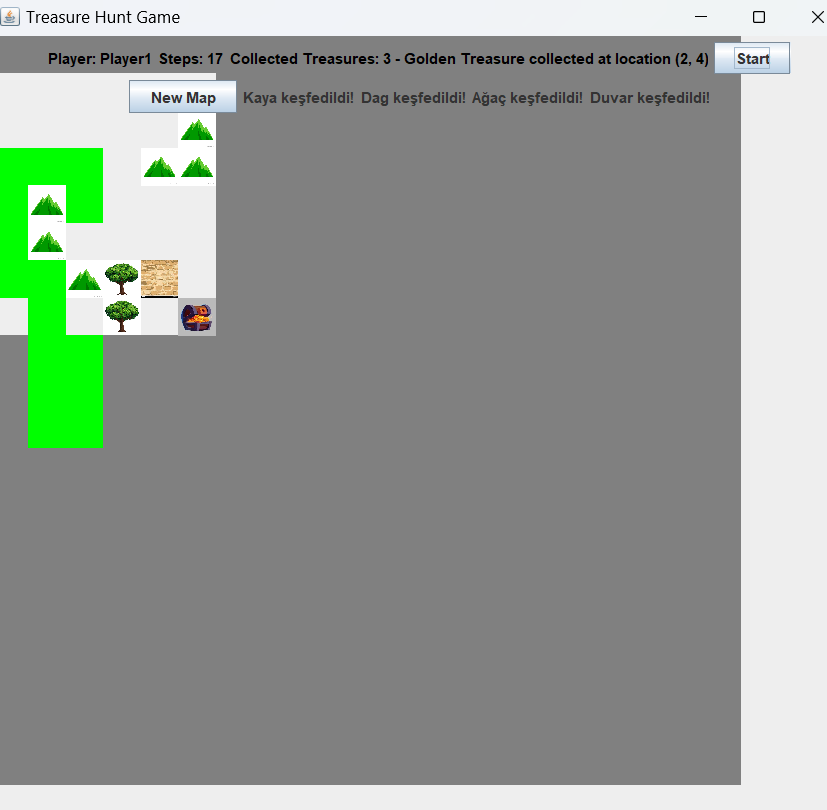
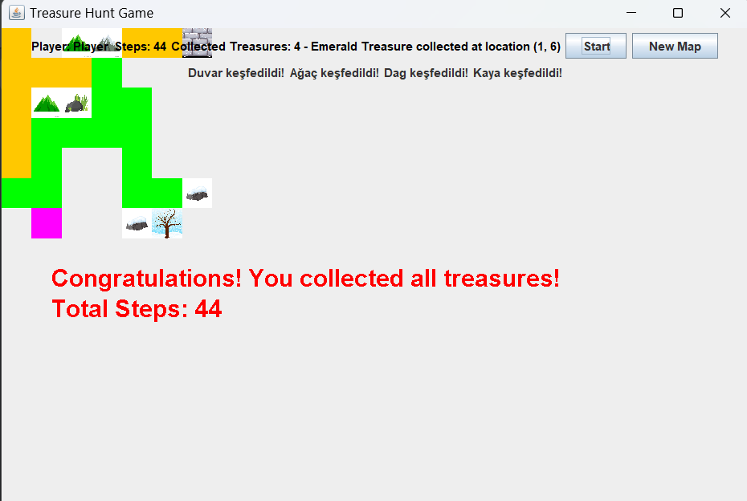

# Otonom Hazine Avcısı (Autonomous Treasure Hunter)

## Overview
This project is a game in which an autonomous character navigates through various obstacles to find the shortest path and collect treasures. The primary goal of this project is to develop an algorithm that enables the character to gather all the treasures in the shortest possible time. Object-oriented programming (OOP) and data structures have been utilized to achieve this goal. The project consists of key components such as map generation, obstacle and treasure placement, character movement, and shortest path calculation.

## Table of Contents
- [Overview](#overview)
- [Introduction](#introduction)
- [Technologies Used](#technologies-used)
- [Methodology](#methodology)
- [Algorithms and Functions](#algorithms-and-functions)
- [Classes](#classes)
- [Game Flow](#game-flow)
- [Results](#results)
- [References](#references)

## Introduction
With the rapid advancement of technology, autonomous systems that can make independent decisions are becoming increasingly common. In this context, the design and development of autonomous systems have become a significant field. The **"Autonomous Treasure Hunter"** project aims to enhance students' understanding of object-oriented programming and data structures while improving their problem-solving skills.

The main objective of this project is to design an algorithm that allows an autonomous character to navigate a predefined map and collect treasures. The algorithm ensures that the character reaches all the treasures in the most efficient way while avoiding obstacles. The project includes:

- Randomly generating a new map each time the application starts
- Placing static and dynamic obstacles according to summer and winter themes
- Ensuring that the character moves towards the nearest treasure using the shortest path
- Visualizing the shortest path on the map in green
- Displaying real-time updates about collected treasures and character movement

This report provides a detailed explanation of the project, including the implemented algorithms, class structures, and project results.

## Technologies Used
- **Programming Language:** Java
- **Development Environment:** IntelliJ IDEA
- **Graphics Library:** Java Swing

## Methodology
### Map Generation
- The game map is randomly generated every time the application starts.
- A 2D grid-based representation is used for map generation.
- Obstacles and treasures are placed randomly within the grid.
- The starting position of the player is set at a safe distance from obstacles and treasures.
- Dynamic obstacles (moving obstacles) are placed in predefined movement patterns.

### Treasure Placement
- A fixed number of treasure chests are placed in random locations.
- Each chest is assigned a different type of treasure (Gold, Silver, Ruby, etc.).
- The placement ensures that treasure chests do not overlap with obstacles or each other.

### Moving Obstacles
- Horizontal and vertical obstacles move randomly across the grid.
- The movement of obstacles follows a controlled pattern to prevent blocking all possible paths.
- If an obstacle reaches a boundary or another obstacle, it changes direction.
- Obstacles move at random intervals to increase game difficulty.

### Character Movement
- The character starts at a predefined location.
- The character calculates the shortest path to the nearest treasure using the **A* Algorithm**.
- The movement is constrained to horizontal and vertical steps; diagonal movement is not allowed.
- The character can only see a limited portion of the map (fog of war mechanism).
- When a treasure is collected, the shortest path to the next nearest treasure is recalculated.

## Algorithms and Functions
### `generateMap()`
- Creates a randomized grid-based game map.
- Assigns different values for different terrain types (e.g., `0` for empty cells, `1` for mountains, `2` for rocks, `3` for walls, `4` for trees).

### `placeTreasures()`
- Randomly distributes treasure chests across the map.
- Ensures that no two treasure chests are placed too close to each other.
- Assigns a specific type and value to each treasure.

### `placeMovingObstacles()`
- Randomly places horizontal and vertical moving obstacles.
- Assigns a movement pattern to each obstacle.

### `moveMovingObstacles()`
- Moves obstacles based on their assigned movement patterns.
- Changes the direction of obstacles upon collision with walls or other obstacles.

### `getNextMove(Point start, Point end)`
- Uses **A* Algorithm** to determine the next best move.
- Calculates the cost of each step and selects the most efficient path.

### `checkCollisions()`
- Detects if the character collides with an obstacle or treasure.
- Handles collision scenarios by adjusting character movement.

### `findNearestTreasure()`
- Identifies the closest treasure using distance calculations.

### `checkGameEnd()`
- Determines whether all treasures have been collected or the character is unable to proceed.

## Classes
### `TreasureHuntGame`
- Manages the entire game logic.
- Initializes the game components, map, and obstacles.
- Handles player movement and collision detection.

### `Treasure`
- Represents a treasure chest with properties such as type, location, and value.
- Contains methods to retrieve treasure information and images.

### `HorizontalMovingObstacle` & `VerticalMovingObstacle`
- Represent dynamically moving obstacles.
- Keep track of previous locations and movement history.

## Game Flow
1. The game starts with a randomly generated map.
2. The character moves towards the nearest treasure while avoiding obstacles.
3. Moving obstacles change their positions dynamically.
4. The shortest path is calculated using **A* Algorithm** at each step.
5. The game ends when all treasures are collected or the character is blocked.
6. The collected treasures and movement statistics are displayed to the player.

## Results
The **"Autonomous Treasure Hunter"** project successfully applies object-oriented programming and data structures to develop an interactive game. The game effectively demonstrates how pathfinding algorithms and dynamic obstacle management can be used to create a challenging environment.

This project helps students:
- Improve problem-solving and algorithm development skills.
- Gain practical experience in software development and debugging.
- Enhance their understanding of AI-based decision-making systems.

Overall, this project provides a fun and educational way to explore advanced programming concepts.

## References
- Lafore, Robert. "Data Structures and Algorithms in Java." Sams Publishing, 2018.
- GeeksforGeeks. "Java Programming Language." [GeeksforGeeks](https://www.geeksforgeeks.org/java/)
- Tutorialspoint. "Java - Encapsulation." [Tutorialspoint](https://www.tutorialspoint.com/java/java_encapsulation.htm)
- Baeldung. "Java Inheritance." [Baeldung](https://www.baeldung.com/java-inheritance)
- IntelliJ IDEA. "Official Documentation." [JetBrains](https://www.jetbrains.com/idea/documentation)

## Ekran Görüntüleri

### Start Screen

### Map Configuration

### In-Game View

### End Game Screen

